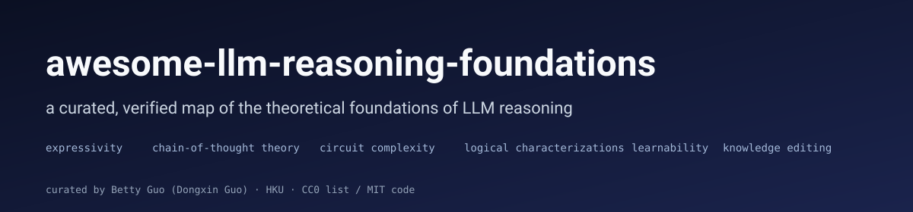

<!-- THIS FILE IS GENERATED. Edit entries/*.yaml and run `python tools/build_readme.py`. -->

  

<h1 align="center">Awesome LLM Reasoning Foundations</h1>

  
  
  
  

A curated, rigorously-verified map of the **theoretical foundations of LLM reasoning** — expressivity, chain-of-thought error bounds, circuit complexity, logical characterizations, learnability of in-context tasks, and knowledge-editing impossibility results.

## Scope

**IN scope:** formal expressivity results for transformers; chain-of-thought theory and error bounds; circuit / communication / parallel complexity; logical characterizations (FOC[Attn], FO+MOD, counting logics); learnability and sample-complexity theory; knowledge-editing impossibility results; lecture notes and surveys covering the above.

**OUT of scope (intentionally):** CoT prompting tricks and engineering recipes; agent frameworks; RLHF / RLVR methodology; o1 / DeepSeek-R1 follow-ups that don't carry a formal result; jailbreaks; leaderboards; multimodal CoT applications. Excellent applied lists already exist — see *Related lists* below.

Every entry below was verified against arXiv / OpenReview / ACL Anthology before inclusion. Entries that could not be verified are dropped, not guessed.

## Curator

Maintained by **Betty Guo (Dongxin Guo)** — final-year CS PhD candidate, University of Hong Kong, advised by Prof. Siu-Ming Yiu. Research in the formal foundations of LLM reasoning.

- GitHub: [@bettyguo](https://github.com/bettyguo)
- ORCID: [0009-0000-2388-1072](https://orcid.org/0009-0000-2388-1072)

If you spot an error, please open an issue — citation accuracy is the whole point of this list.

## Contents

- [Expressivity & Representational Limits](#expressivity-representational-limits) (14)
- [Chain-of-Thought: Theory & Error Bounds](#chain-of-thought-theory-error-bounds) (12)
- [Circuit & Communication Complexity](#circuit-communication-complexity) (8)
- [Logical Characterizations](#logical-characterizations) (5)
- [Learnability & Sample Complexity](#learnability-sample-complexity) (20)
- [Knowledge Editing & Impossibility Results](#knowledge-editing-impossibility-results) (13)
- [Parallel / Architectural Complexity & Scaling](#parallel-architectural-complexity-scaling) (6)
- [Surveys, Lecture Notes & Talks](#surveys-lecture-notes-talks) (3)

## Expressivity & Representational Limits

- **A Little Depth Goes a Long Way: The Expressive Power of Log-Depth Transformers** — William Merrill, Ashish Sabharwal (2025, NeurIPS 2025). [paper](https://arxiv.org/abs/2503.03961). _Why it matters:_ Proves that uniform Θ(log n)-depth transformers can express regular-language recognition and graph connectivity — problems unreachable by fixed-depth variants under standard complexity conjectures, identifying depth (not width or CoT length) as the efficient scaling axis.
- **Tighter Bounds on the Expressivity of Transformer Encoders** — David Chiang, Peter Cholak, Anand Pillay (2023, ICML 2023). [paper](https://arxiv.org/abs/2301.10743). _Why it matters:_ Sharpens the upper-bound side of transformer expressivity by characterizing fixed-precision soft-attention encoders within a counting-extension of first-order logic — a precursor to the logical-characterization line.
- **Neural Networks and the Chomsky Hierarchy** — Grégoire Delétang et al. (2023, ICLR 2023). [paper](https://arxiv.org/abs/2207.02098). _Why it matters:_ Empirically maps which Chomsky-hierarchy classes each architecture (RNN, LSTM, Transformer, Stack-RNN, NDStack-RNN, Tape-RNN) generalizes on, providing the field's standard reference benchmark for architectural expressivity.
- **Tracr: Compiled Transformers as a Laboratory for Interpretability** — David Lindner et al. (2023, NeurIPS 2023 (Spotlight)). [paper](https://arxiv.org/abs/2301.05062). _Why it matters:_ Implements a compiler from RASP programs to concrete transformer weights, giving a constructive existence proof and a controlled testbed for studying which RASP idioms the architecture can host.
- **Memory Augmented Large Language Models are Computationally Universal** — Dale Schuurmans (2023). [paper](https://arxiv.org/abs/2301.04589). _Why it matters:_ Shows that a fixed Flan-U-PaLM 540B augmented with an external read/write memory tape simulates a universal Turing machine, shifting the locus of LLM expressivity from internal parameters to the inference-time loop.
- **Formal Language Recognition by Hard Attention Transformers: Perspectives from Circuit Complexity** — Yiding Hao, Dana Angluin, Robert Frank (2022, TACL 2022). [paper](https://arxiv.org/abs/2204.06618). _Why it matters:_ Places hard-attention transformer encoders inside AC0 and gives matching lower-bound separations between hard-attention variants, anchoring the circuit-complexity view of attention.
- **Saturated Transformers are Constant-Depth Threshold Circuits** — William Merrill, Ashish Sabharwal, Noah A. Smith (2022, TACL 2022). [paper](https://arxiv.org/abs/2106.16213). _Why it matters:_ Shows that saturated-attention transformers (a hard-attention idealization with averaging over maxima) are simulable by uniform TC0 circuits, placing a hard upper bound on what such transformers can compute.
- **Attention is Turing-Complete** — Jorge Pérez, Pablo Barceló, Javier Marinkovic (2021, JMLR 22(75):1-35, 2021). [paper](https://jmlr.org/papers/v22/20-302.html). _Why it matters:_ Refines the earlier ICLR 2019 result to show that a hard-attention Transformer alone — without residual or other architectural extras — already simulates any Turing machine under unbounded precision.
- **Self-Attention Networks Can Process Bounded Hierarchical Languages** — Shunyu Yao et al. (2021, ACL 2021). [paper](https://arxiv.org/abs/2105.11115) · [code](https://github.com/princeton-nlp/dyck-transformer). _Why it matters:_ Constructs O(log n)-depth transformers recognizing Dyck-k with bounded nesting depth, showing self-attention's depth-vs-stack tradeoff for hierarchical languages.
- **On the Computational Power of Transformers and its Implications in Sequence Modeling** — Satwik Bhattamishra, Arkil Patel, Navin Goyal (2020, CoNLL 2020). [paper](https://arxiv.org/abs/2006.09286). _Why it matters:_ Gives a Turing-completeness argument for transformer encoder-decoders under unbounded-precision assumptions and pinpoints residual connections and positional encodings as load-bearing for the construction.
- **On the Ability and Limitations of Transformers to Recognize Formal Languages** — Satwik Bhattamishra, Kabir Ahuja, Navin Goyal (2020, EMNLP 2020). [paper](https://arxiv.org/abs/2009.11264). _Why it matters:_ Empirically separates which counter, shuffle, and Dyck languages transformers can and cannot recognize, anchoring later theoretical work on transformer expressivity in concrete language-class boundaries.
- **Theoretical Limitations of Self-Attention in Neural Sequence Models** — Michael Hahn (2020, TACL 2020). [paper](https://arxiv.org/abs/1906.06755). _Why it matters:_ Shows that hard-attention transformers cannot model Parity or Dyck-2, and that soft-attention transformers solve them only with attention entropy growing in input length — an early formal obstruction to in-distribution length generalization.
- **Are Transformers universal approximators of sequence-to-sequence functions?** — Chulhee Yun et al. (2020, ICLR 2020). [paper](https://arxiv.org/abs/1912.10077). _Why it matters:_ Proves that transformers with fixed width can universally approximate continuous permutation-equivariant sequence-to-sequence functions on compact domains, isolating positional encodings as the source of the non-equivariant extension.
- **On the Turing Completeness of Modern Neural Network Architectures** — Jorge Pérez, Javier Marinković, Pablo Barceló (2019, ICLR 2019). [paper](https://arxiv.org/abs/1901.03429). _Why it matters:_ Proves Turing-completeness for the Transformer and Neural GPU under unbounded precision and arbitrary input access, while flagging that the construction relies on conditions not satisfied by practical implementations.

## Chain-of-Thought: Theory & Error Bounds

- **Transformers Provably Solve Parity Efficiently with Chain of Thought** — Juno Kim, Taiji Suzuki (2025, ICLR 2025 (Oral)). [paper](https://arxiv.org/abs/2410.08633). _Why it matters:_ Constructs a small transformer with CoT that learns and computes Parity using O(n) intermediate tokens and proves sample-efficient learnability under SGD — the first end-to-end (expressivity + trainability) result on Parity for transformers.
- **To CoT or not to CoT? Chain-of-thought helps mainly on math and symbolic reasoning** — Zayne Sprague et al. (2025, ICLR 2025). [paper](https://arxiv.org/abs/2409.12183). _Why it matters:_ Meta-analyzes 100+ CoT-vs-direct comparisons and shows CoT helps almost exclusively on math/symbolic tasks, sharpening where the theoretical compute-extension argument matters in practice.
- **The pitfalls of next-token prediction** — Gregor Bachmann, Vaishnavh Nagarajan (2024, ICML 2024). [paper](https://arxiv.org/abs/2403.06963). _Why it matters:_ Identifies the 'Clever Hans cheat' and 'snowball error' failure modes of teacher-forced next-token training, showing planning-like tasks suffer in-principle even with perfect data — a formal critique of vanilla autoregressive learning.
- **Think before you speak: Training Language Models With Pause Tokens** — Sachin Goyal et al. (2024, ICLR 2024). [paper](https://arxiv.org/abs/2310.02226). _Why it matters:_ Trains decoder-only models to consume learnable "pause" tokens before answering and shows reasoning gains, providing an empirical counterpart to the theoretical claim that intermediate-token compute extends what a constant-depth transformer can decide.
- **Chain of Thought Empowers Transformers to Solve Inherently Serial Problems** — Zhiyuan Li et al. (2024, ICLR 2024). [paper](https://arxiv.org/abs/2402.12875). _Why it matters:_ Proves that with T(n) steps of CoT a constant-depth transformer simulates T(n)-step sequential computation, recovering serial-complexity classes that lie outside the parallel reach of a single forward pass.
- **The Expressive Power of Transformers with Chain of Thought** — William Merrill, Ashish Sabharwal (2024, ICLR 2024). [paper](https://arxiv.org/abs/2310.07923) · [openreview](https://openreview.net/forum?id=NjNGlPh8Wh). _Why it matters:_ Characterizes the expressive power of decoder-only transformers with intermediate CoT tokens as a function of generation length: log-many steps stay in TC0, linear-many reach P, polynomial-many reach EXPTIME.
- **Let's Think Dot by Dot: Hidden Computation in Transformer Language Models** — Jacob Pfau, William Merrill, Samuel R. Bowman (2024, COLM 2024). [paper](https://arxiv.org/abs/2404.15758). _Why it matters:_ Shows that semantically empty filler tokens can boost transformer accuracy on parallelizable tasks, empirically separating CoT's compute-extension role from its interpretability role.
- **Towards Revealing the Mystery behind Chain of Thought: A Theoretical Perspective** — Guhao Feng et al. (2023, NeurIPS 2023). [paper](https://arxiv.org/abs/2305.15408). _Why it matters:_ Constructs a constant-size CoT transformer that solves arithmetic and dynamic-programming tasks unreachable by any fixed-depth no-CoT transformer, giving an unconditional separation between with-CoT and without-CoT expressivity.
- **Measuring Faithfulness in Chain-of-Thought Reasoning** — Tamera Lanham et al. (2023). [paper](https://arxiv.org/abs/2307.13702). _Why it matters:_ Operationalizes "faithfulness" of CoT (truncation, paraphrase, mistakes-injection tests) and measures it across model scales — many CoTs are post-hoc rationalizations, complicating their use as inference-process evidence.
- **Auto-Regressive Next-Token Predictors are Universal Learners** — Eran Malach (2023). [paper](https://arxiv.org/abs/2309.06979). _Why it matters:_ Shows that autoregressive next-token prediction with a chain of thought is a universal learner: any efficiently computable function can be expressed by an autoregressive predictor with polynomially-bounded intermediate token complexity.
- **Why think step by step? Reasoning emerges from the locality of experience** — Ben Prystawski, Michael Y. Li, Noah D. Goodman (2023). [paper](https://arxiv.org/abs/2304.03843). _Why it matters:_ Shows in a Bayesian-network model that CoT helps precisely when training-time evidence is locally connected but globally sparse — chained inference recovers conditional independencies that direct prediction cannot.
- **Sub-Task Decomposition Enables Learning in Sequence to Sequence Tasks** — Noam Wies, Yoav Levine, Amnon Shashua (2023, ICLR 2023). [paper](https://arxiv.org/abs/2204.02892). _Why it matters:_ Proves a learnability separation: composite sequence-to-sequence tasks that are hard to learn end-to-end become PAC-learnable once decomposed into sub-tasks at training time — an early formal case for intermediate-step supervision.

## Circuit & Communication Complexity

- **Provably learning a multi-head attention layer** — Sitan Chen, Yuanzhi Li (2024). [paper](https://arxiv.org/abs/2402.04084). _Why it matters:_ Gives the first polynomial-time learning algorithm with provable guarantees for a single multi-head attention layer under non-degeneracy conditions, plus matching lower bounds — initiates the computational-learning-theory analysis of attention.
- **The Illusion of State in State-Space Models** — William Merrill, Jackson Petty, Ashish Sabharwal (2024, ICML 2024). [paper](https://arxiv.org/abs/2404.08819). _Why it matters:_ Shows that linear and Mamba-style state-space models, despite being marketed as recurrent, still live in TC0 — they cannot track state-dependent problems (e.g. S5 word problem) any better than transformers can.
- **On Limitations of the Transformer Architecture** — Binghui Peng, Srini Narayanan, Christos Papadimitriou (2024). [paper](https://arxiv.org/abs/2402.08164). _Why it matters:_ Uses communication-complexity arguments to show that bounded-depth, polynomial-width transformers cannot solve function composition or iterated reasoning at input length n unless they violate widely-believed complexity assumptions.
- **Transformers, parallel computation, and logarithmic depth** — Clayton Sanford, Daniel Hsu, Matus Telgarsky (2024). [paper](https://arxiv.org/abs/2402.09268). _Why it matters:_ Identifies a hierarchy of multi-hop tasks ('k-hop induction') where O(log n)-depth attention is necessary and sufficient, separating shallow transformers from MLPs and recurrent baselines by parallel-computation depth.
- **Transformers Provably Learn Sparse Token Selection While Fully-Connected Nets Cannot** — Zixuan Wang et al. (2024). [paper](https://arxiv.org/abs/2406.06893). _Why it matters:_ Provides a learning separation between transformers and MLPs on a sparse-token-selection task, showing transformers learn the task in polynomial samples while any polynomial-width MLP requires exponentially many.
- **Memorization Capacity of Multi-Head Attention in Transformers** — Sadegh Mahdavi, Renjie Liao, Christos Thrampoulidis (2023, ICLR 2024). [paper](https://arxiv.org/abs/2306.02010). _Why it matters:_ Proves that an H-head attention layer with O(Hd^2) parameters memorizes Θ(Hn) examples, isolating multi-head structure as the source of the memorization-vs-parameters scaling.
- **The Parallelism Tradeoff: Limitations of Log-Precision Transformers** — William Merrill, Ashish Sabharwal (2023, TACL 2023). [paper](https://arxiv.org/abs/2207.00729). _Why it matters:_ Proves that any log-precision transformer can be simulated by uniform constant-depth threshold circuits (TC0), so a single forward pass cannot decide problems believed to lie outside TC0 (e.g. matrix permanent, S5 word problem).
- **Representational Strengths and Limitations of Transformers** — Clayton Sanford, Daniel Hsu, Matus Telgarsky (2023, NeurIPS 2023). [paper](https://arxiv.org/abs/2306.02896). _Why it matters:_ Gives matching upper and lower bounds for transformer width/depth on three-way matching and triple-detection tasks, separating attention from MLPs and unidirectional RNNs via communication-complexity arguments.

## Logical Characterizations

- **Logical Languages Accepted by Transformer Encoders with Hard Attention** — Pablo Barceló et al. (2024, ICLR 2024). [paper](https://arxiv.org/abs/2310.03817). _Why it matters:_ Shows that unique-hard-attention encoders accept exactly the first-order definable languages with unary numerical predicates (a strict subset of AC0), and that average-hard-attention encoders climb to TC0 but no higher.
- **Counting Like Transformers: Compiling Temporal Counting Logic Into Softmax Transformers** — Andy Yang, David Chiang (2024). [paper](https://arxiv.org/abs/2404.04393). _Why it matters:_ Compiles temporal counting logic K[#] directly into softmax-attention transformers, giving a constructive lower bound and refining the logical characterization of soft-attention encoders.
- **Masked Hard-Attention Transformers Recognize Exactly the Star-Free Languages** — Andy Yang, David Chiang, Dana Angluin (2024, NeurIPS 2024). [paper](https://arxiv.org/abs/2310.13897). _Why it matters:_ Proves an exact characterization: causal hard-attention transformers without position embeddings recognize precisely the star-free regular languages, equivalent to LTL or FO[<].
- **A Logic for Expressing Log-Precision Transformers** — William Merrill, Ashish Sabharwal (2023, NeurIPS 2023). [paper](https://arxiv.org/abs/2210.02671). _Why it matters:_ Embeds log-precision transformers in first-order logic with majority quantifiers (FOM), giving the first logical upper-bound characterization of a realistic transformer variant.
- **Overcoming a Theoretical Limitation of Self-Attention** — David Chiang, Peter Cholak (2022, ACL 2022). [paper](https://arxiv.org/abs/2202.12172). _Why it matters:_ Shows that augmenting attention with layer normalization in a particular way lets transformers recognize Parity and Dyck-1 — i.e. the Hahn 2020 obstruction is tied to the specific attention variant studied, not to attention per se.

## Learnability & Sample Complexity

- **Linear attention is (maybe) all you need (to understand transformer optimization)** — Kwangjun Ahn et al. (2024, ICLR 2024). [paper](https://arxiv.org/abs/2310.01082). _Why it matters:_ Argues that single-layer linear-attention models reproduce many of the optimization-landscape phenomena of full transformers (heavy-tailed gradients, edge-of-stability), giving a tractable surrogate for studying transformer training dynamics.
- **In-Context Language Learning: Architectures and Algorithms** — Ekin Akyürek et al. (2024). [paper](https://arxiv.org/abs/2401.12973). _Why it matters:_ Extends ICL theory from regression to formal-language learning: builds a benchmark of in-context formal-language tasks and shows transformers approach the Bayes-optimal learner where state-space models lag.
- **How Transformers Learn Causal Structure with Gradient Descent** — Eshaan Nichani, Alex Damian, Jason D. Lee (2024, ICML 2024). [paper](https://arxiv.org/abs/2402.14735). _Why it matters:_ Proves that a two-layer attention model trained on data with a latent causal graph recovers that graph in its attention pattern with polynomial sample complexity — a learnability-of-structure result for transformers.
- **The mechanistic basis of data dependence and abrupt learning in an in-context classification task** — Gautam Reddy (2024, ICLR 2024). [paper](https://arxiv.org/abs/2312.03002). _Why it matters:_ Distills the ICL/induction-head transition into a tractable two-layer model and derives, in closed form, how the abruptness and data-dependence of ICL emergence depend on pretraining-distribution structure.
- **RNNs are not Transformers (Yet): The Key Bottleneck on In-context Retrieval** — Kaiyue Wen, Xingyu Dang, Kaifeng Lyu (2024). [paper](https://arxiv.org/abs/2402.18510). _Why it matters:_ Proves a representational separation: RNNs of any polynomial size cannot perform in-context retrieval of length-Θ(n) keys, while transformers can, identifying retrieval as a hard ceiling for non-attention sequence models.
- **How Many Pretraining Tasks Are Needed for In-Context Learning of Linear Regression?** — Jingfeng Wu et al. (2024, ICLR 2024). [paper](https://arxiv.org/abs/2310.08391). _Why it matters:_ Proves a sharp threshold on the number of pretraining tasks required for a linear-attention model to ICL-generalize to unseen tasks, complementing Raventós et al.'s empirical task-diversity phase transition with closed-form bounds.
- **Transformers learn to implement preconditioned gradient descent for in-context learning** — Kwangjun Ahn et al. (2023, NeurIPS 2023). [paper](https://arxiv.org/abs/2306.00297). _Why it matters:_ Shows that the loss landscape of trained linear-attention layers admits a stationary point implementing preconditioned gradient descent — sharper than 'plain GD' and matching empirical performance.
- **What learning algorithm is in-context learning? Investigations with linear models** — Ekin Akyürek et al. (2023, ICLR 2023). [paper](https://arxiv.org/abs/2211.15661). _Why it matters:_ Demonstrates that transformers trained on linear-regression ICL tasks implement gradient-descent and ridge-regression-like estimators internally, with explicit weight constructions reproducing the empirical behavior.
- **Physics of Language Models: Part 1, Learning Hierarchical Language Structures** — Zeyuan Allen-Zhu, Yuanzhi Li (2023). [paper](https://arxiv.org/abs/2305.13673). _Why it matters:_ Controlled experiments on synthetic CFG-generated text show transformers acquire hierarchical syntactic structure through a specific attention pattern ("diagonal then off-diagonal") tied to grammar depth.
- **Birth of a Transformer: A Memory Viewpoint** — Alberto Bietti et al. (2023, NeurIPS 2023). [paper](https://arxiv.org/abs/2306.00802). _Why it matters:_ Models the formation of bigram-and-induction-head circuits during pretraining as a memory-association process, deriving scaling-law-style predictions for when each capability emerges.
- **A Theory of Emergent In-Context Learning as Implicit Structure Induction** — Michael Hahn, Navin Goyal (2023). [paper](https://arxiv.org/abs/2303.07971). _Why it matters:_ Derives ICL as a consequence of compositional structure in pretraining data, predicting concrete scaling laws for the emergence threshold as a function of data compositionality.
- **One Step of Gradient Descent is Provably the Optimal In-Context Learner with One Layer of Linear Self-Attention** — Arvind Mahankali, Tatsunori B. Hashimoto, Tengyu Ma (2023, ICLR 2024). [paper](https://arxiv.org/abs/2307.03576). _Why it matters:_ Proves that for ICL on linear regression with a single linear-attention layer, the global-minimum solution is exactly one step of gradient descent on the in-context dataset — the tightest characterization in this regime.
- **Transformers learn in-context by gradient descent** — Johannes von Oswald et al. (2023, ICML 2023). [paper](https://arxiv.org/abs/2212.07677). _Why it matters:_ Constructs single-layer linear-attention transformers that exactly implement one step of gradient descent on a least-squares objective, and shows trained models converge to this construction.
- **Pretraining task diversity and the emergence of non-Bayesian in-context learning for regression** — Allan Raventós et al. (2023, NeurIPS 2023). [paper](https://arxiv.org/abs/2306.15063). _Why it matters:_ Identifies a sharp pretraining-task-diversity threshold beyond which transformers switch from in-distribution Bayesian ICL to ridge-regression-like behavior generalizing to unseen tasks.
- **Transformers as Support Vector Machines** — Davoud Ataee Tarzanagh et al. (2023). [paper](https://arxiv.org/abs/2308.16898). _Why it matters:_ Shows that the implicit bias of self-attention trained by gradient descent solves a hard-margin SVM-like objective in token space, characterizing which tokens attention "selects" at convergence.
- **Trained Transformers Learn Linear Models In-Context** — Ruiqi Zhang, Spencer Frei, Peter L. Bartlett (2023). [paper](https://arxiv.org/abs/2306.09927). _Why it matters:_ Proves that a single linear-attention layer trained on linear-regression ICL data converges to a one-step gradient-descent predictor, with explicit non-asymptotic optimization rates.
- **Inductive Biases and Variable Creation in Self-Attention Mechanisms** — Benjamin L. Edelman et al. (2022, ICML 2022). [paper](https://arxiv.org/abs/2110.10090). _Why it matters:_ Proves sample-complexity bounds for self-attention learning sparse Boolean functions, showing the head structure provides an inductive bias that is exponentially more sample-efficient than fully-connected networks on this class.
- **What Can Transformers Learn In-Context? A Case Study of Simple Function Classes** — Shivam Garg et al. (2022, NeurIPS 2022). [paper](https://arxiv.org/abs/2208.01066). _Why it matters:_ Shows empirically and analytically that transformers trained on synthetic regression data implement, at inference, a near-optimal learner for the underlying function class — the foundational ICL-as-meta-learning result.
- **In-context Learning and Induction Heads** — Catherine Olsson et al. (2022). [paper](https://arxiv.org/abs/2209.11895). _Why it matters:_ Identifies "induction heads" as the circuit responsible for the in-context learning capability and times their formation to a sharp pretraining-loss bump, linking mechanistic structure to the emergence of ICL.
- **An Explanation of In-context Learning as Implicit Bayesian Inference** — Sang Michael Xie et al. (2022, ICLR 2022). [paper](https://arxiv.org/abs/2111.02080). _Why it matters:_ Models pretraining as a mixture-of-HMMs prior and shows in-context learning emerges as posterior inference over latent task variables, predicting the empirical scaling of demo-count benefits.

## Knowledge Editing & Impossibility Results

- **Evaluating the Ripple Effects of Knowledge Editing in Language Models** — Roi Cohen et al. (2024, TACL 2024). [paper](https://arxiv.org/abs/2307.12976). _Why it matters:_ Defines logical ripple-effect tests (composition, two-hop, subject aliasing) for edited models and shows existing methods fail them, formalizing why naive locate-and-edit underspecifies knowledge editing.
- **A Comprehensive Study of Knowledge Editing for Large Language Models** — Ningyu Zhang et al. (2024). [paper](https://arxiv.org/abs/2401.01286). _Why it matters:_ Standardizes the evaluation protocol (KnowEdit) and benchmarks every major editing approach on a single axis, providing the reference dataset behind subsequent theoretical claims about the locality–generality tradeoff.
- **Physics of Language Models: Part 3.1, Knowledge Storage and Extraction** — Zeyuan Allen-Zhu, Yuanzhi Li (2023, ICML 2024). [paper](https://arxiv.org/abs/2309.14316). _Why it matters:_ Demonstrates that knowledge memorized without augmented paraphrasing during pretraining is not extractable downstream, with linear-probing evidence linking extraction success to specific token-embedding encodings.
- **Physics of Language Models: Part 3.2, Knowledge Manipulation** — Zeyuan Allen-Zhu, Yuanzhi Li (2023). [paper](https://arxiv.org/abs/2309.14402). _Why it matters:_ Shows that even when knowledge is reliably extractable, simple manipulations of that knowledge (inverse lookup, comparison, composition) systematically fail — formalizing a manipulation-vs-storage gap.
- **Dissecting Recall of Factual Associations in Auto-Regressive Language Models** — Mor Geva et al. (2023, EMNLP 2023). [paper](https://arxiv.org/abs/2304.14767). _Why it matters:_ Decomposes factual recall into three stages (subject enrichment, relation propagation, attribute extraction), giving a refined picture of where edits do and do not propagate — directly relevant to ripple-effect and impossibility results.
- **Does Localization Inform Editing? Surprising Differences in Causality-Based Localization vs. Knowledge Editing in Language Models** — Peter Hase et al. (2023, NeurIPS 2023). [paper](https://arxiv.org/abs/2301.04213). _Why it matters:_ Shows that edit success is largely independent of the causal-trace 'hot' layer — a dissociation between localization signal and edit efficacy that complicates ROME's mechanistic interpretation.
- **Mass-Editing Memory in a Transformer** — Kevin Meng et al. (2023, ICLR 2023). [paper](https://arxiv.org/abs/2210.07229) · [project](https://memit.baulab.info). _Why it matters:_ Extends ROME to thousands of simultaneous edits by solving a per-layer normal-equation update, giving the canonical 'edit-scale' baseline that later impossibility-style results push against.
- **Editing Large Language Models: Problems, Methods, and Opportunities** — Yunzhi Yao et al. (2023, EMNLP 2023). [paper](https://arxiv.org/abs/2305.13172). _Why it matters:_ Catalogues knowledge-editing approaches and benchmarks, surfacing the structural tradeoffs (locality vs. generalization vs. reliability) that motivate impossibility-style follow-ups.
- **Locating and Editing Factual Associations in GPT** — Kevin Meng et al. (2022, NeurIPS 2022). [paper](https://arxiv.org/abs/2202.05262) · [project](https://rome.baulab.info). _Why it matters:_ Introduces causal tracing to localize factual recall to mid-layer MLPs and edits a single weight matrix (rank-one ROME update) to rewrite a fact — the load-bearing empirical claim that subsequent theoretical work tests.
- **Fast Model Editing at Scale** — Eric Mitchell et al. (2022, ICLR 2022). [paper](https://arxiv.org/abs/2110.11309). _Why it matters:_ Introduces MEND, a hypernetwork that produces low-rank weight edits from a single fact, establishing the meta-learning paradigm against which ROME and later locality-based methods compete.
- **Memory-Based Model Editing at Scale** — Eric Mitchell et al. (2022, ICML 2022). [paper](https://arxiv.org/abs/2206.06520). _Why it matters:_ Proposes SERAC — store edits in an external cache and route queries through a learned scope classifier — providing a weights-untouched baseline that complements parameter-editing methods.
- **Editing Factual Knowledge in Language Models** — Nicola De Cao, Wilker Aziz, Ivan Titov (2021, EMNLP 2021). [paper](https://arxiv.org/abs/2104.08164). _Why it matters:_ Introduces KnowledgeEditor — a constrained-gradient method that updates a single fact while penalizing collateral changes — the first formulation of locality/specificity tradeoffs that subsequent impossibility-style results probe.
- **Transformer Feed-Forward Layers Are Key-Value Memories** — Mor Geva et al. (2021, EMNLP 2021). [paper](https://arxiv.org/abs/2012.14913). _Why it matters:_ Provides the load-bearing empirical claim that feed-forward sublayers behave as key-value memories — the mechanism that ROME, MEMIT, and later locate-and-edit work depend on.

## Parallel / Architectural Complexity & Scaling

- **Why are Sensitive Functions Hard for Transformers?** — Michael Hahn, Mark Rofin (2024, ACL 2024). [paper](https://arxiv.org/abs/2402.09963). _Why it matters:_ Proves a loss-landscape bias: transformer parameters minimizing training loss tend to compute functions of low average sensitivity, explaining why parity-like high-sensitivity targets fail to be learned even when expressible.
- **On the Self-Verification Limitations of Large Language Models on Reasoning and Planning Tasks** — Kaya Stechly, Karthik Valmeekam, Subbarao Kambhampati (2024). [paper](https://arxiv.org/abs/2402.08115). _Why it matters:_ Shows that LLMs asked to verify their own reasoning add no measurable signal beyond random self-criticism — a load-bearing negative result against self-consistency / self-correction loops as primitives for reliable reasoning.
- **What Algorithms can Transformers Learn? A Study in Length Generalization** — Hattie Zhou et al. (2024, ICLR 2024). [paper](https://arxiv.org/abs/2310.16028). _Why it matters:_ Proposes the RASP-Generalization Conjecture: transformers length-generalize on a task iff the task admits a short, simple RASP-L program, and empirically supports the prediction across arithmetic and reasoning tasks.
- **Transformers Learn Shortcuts to Automata** — Bingbin Liu et al. (2023, ICLR 2023). [paper](https://arxiv.org/abs/2210.10749). _Why it matters:_ Shows that O(log T)-depth transformers can solve T-step automaton-simulation tasks via algebraic shortcuts (semigroup composition), but those shortcuts brittle-fail out of distribution — quantifying the length-generalization gap.
- **Exploring Length Generalization in Large Language Models** — Cem Anil et al. (2022, NeurIPS 2022). [paper](https://arxiv.org/abs/2207.04901). _Why it matters:_ Shows that naive length extrapolation fails at every scale tested and that scratchpad-style intermediate-token supervision is the primary lever that restores it — early empirical evidence for the CoT-as-compute-extension story.
- **Train Short, Test Long: Attention with Linear Biases Enables Input Length Extrapolation** — Ofir Press, Noah A. Smith, Mike Lewis (2022, ICLR 2022). [paper](https://arxiv.org/abs/2108.12409). _Why it matters:_ Replaces sinusoidal/learned positional encodings with a fixed linear-bias scheme (ALiBi) and shows extrapolation to sequences much longer than training — the load-bearing baseline for subsequent length-generalization theory.

## Surveys, Lecture Notes & Talks

- **What Can('t) Transformers Do? (NeurIPS 2025 Workshop)** — Tobias Schnabel et al. (2025, NeurIPS 2025 Workshop). [paper](https://transformerstheory.github.io/). _Why it matters:_ Community gathering of the transformer-theory subfield: accepted papers and invited talks survey what is known and unknown about transformer expressivity, learnability, and complexity as of late 2025.
- **What Formal Languages Can Transformers Express? A Survey** — Lena Strobl et al. (2024, TACL 12:543-561, 2024). [paper](https://arxiv.org/abs/2311.00208). _Why it matters:_ The reference survey on transformer expressivity: organizes upper- and lower-bound results in terms of attention variant (hard / soft / saturated), precision regime, and logical / circuit characterizations.
- **Are Emergent Abilities of Large Language Models a Mirage?** — Rylan Schaeffer, Brando Miranda, Sanmi Koyejo (2023, NeurIPS 2023). [paper](https://arxiv.org/abs/2304.15004). _Why it matters:_ Shows that many reported "emergent abilities" are artifacts of nonlinear, all-or-nothing metrics; under continuous metrics the same models improve smoothly with scale — a methodological caveat any scaling-law-style claim must address.

## Reading paths

Curated ordered sequences for getting into a sub-area. See [`docs/reading-paths.md`](docs/reading-paths.md) for the full set.

- **Start here for CoT theory** → Merrill & Sabharwal (2024, CoT) → Feng et al. (2023, CoT mystery) → Li et al. (2024, serial problems).
- **Start here for expressivity** → Strobl et al. (2024, survey) → Hahn (2020, limitations) → Merrill, Sabharwal, Smith (2022, saturated → TC0) → Merrill & Sabharwal (2023, log-precision → TC0).
- **Start here for learnability of in-context learning** → Xie et al. (2022, implicit Bayes) → Garg et al. (2022, simple function classes) → von Oswald et al. (2023, GD).

## Recent additions

- 2026-05-14 — [On the Computational Power of Transformers and its Implications in Sequence Modeling](https://arxiv.org/abs/2006.09286)
- 2026-05-14 — [On the Ability and Limitations of Transformers to Recognize Formal Languages](https://arxiv.org/abs/2009.11264)
- 2026-05-14 — [Tighter Bounds on the Expressivity of Transformer Encoders](https://arxiv.org/abs/2301.10743)
- 2026-05-14 — [Neural Networks and the Chomsky Hierarchy](https://arxiv.org/abs/2207.02098)
- 2026-05-14 — [Theoretical Limitations of Self-Attention in Neural Sequence Models](https://arxiv.org/abs/1906.06755)
- 2026-05-14 — [Formal Language Recognition by Hard Attention Transformers: Perspectives from Circuit Complexity](https://arxiv.org/abs/2204.06618)
- 2026-05-14 — [Tracr: Compiled Transformers as a Laboratory for Interpretability](https://arxiv.org/abs/2301.05062)
- 2026-05-14 — [Saturated Transformers are Constant-Depth Threshold Circuits](https://arxiv.org/abs/2106.16213)
- 2026-05-14 — [A Little Depth Goes a Long Way: The Expressive Power of Log-Depth Transformers](https://arxiv.org/abs/2503.03961)
- 2026-05-14 — [On the Turing Completeness of Modern Neural Network Architectures](https://arxiv.org/abs/1901.03429)

## Related lists

Adjacent and complementary lists. Linked in good faith — these cover the *methods* side of LLM reasoning, which this list deliberately excludes.

- [atfortes/Awesome-LLM-Reasoning](https://github.com/atfortes/Awesome-LLM-Reasoning) — methods, CoT → o1 → DeepSeek-R1.
- [srush/awesome-o1](https://github.com/srush/awesome-o1) — o1-centric bibliography.
- [luban-agi/Awesome-LLM-reasoning](https://github.com/luban-agi/Awesome-LLM-reasoning) — broad reasoning paper list.
- [reasoning-survey/Awesome-Reasoning-Foundation-Models](https://github.com/reasoning-survey/Awesome-Reasoning-Foundation-Models) — survey of foundation models for reasoning.
- [JShollaj/awesome-llm-interpretability](https://github.com/JShollaj/awesome-llm-interpretability) — mechanistic interpretability (sibling, not overlap).
- [hemingkx/Awesome-Efficient-Reasoning](https://github.com/hemingkx/Awesome-Efficient-Reasoning) — efficient reasoning.

## Wanted entries

Gaps we want filled by the community are tracked under the [`wanted`](https://github.com/bettyguo/awesome-llm-reasoning-foundations/issues?q=is%3Aissue+label%3Awanted) issue label. Pick one, submit a PR.

## Contributing

Every new entry needs a verification link (arXiv abstract page, OpenReview, or proceedings URL). See [CONTRIBUTING.md](CONTRIBUTING.md). Out-of-scope PRs may be redirected to one of the related lists above — that's the boundary of *this* list, not a judgment of the work.

## License

- List content (`README.md`, `entries/`, `docs/`, `PLANNING/`) — [CC0 1.0](LICENSE), public domain.
- Source code under `tools/` — [MIT](LICENSE-CODE).
